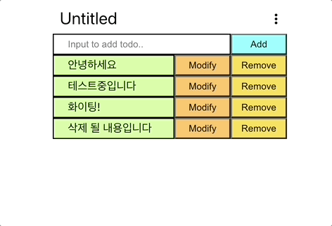
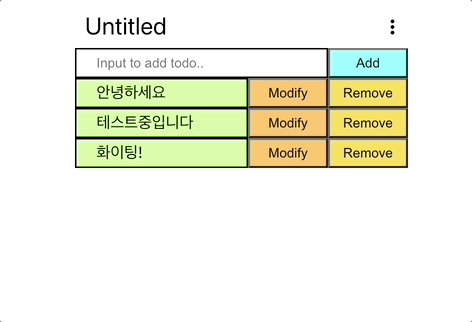

# todolist_frontend(kr)

##### [Click here for English version](README_EN.md)

##### [日本語バージョンはこちらをクリックして下さい](README_JP.md)

## - 목차 -

1. 개요
2. 프로젝트목표
3. 기능시연
4. 차후구현예정기능
5. 개선필요내용
    
    

### 1. 개요

- 프로젝트명 : todolist_frontend
- 기간 : 2023.01.09 - 2023. 01. 15(7일)
- 인원 : 1인
- 기술스택 :  
     
   
   

### 2. 프로젝트목표

1. 간단한 CRUD기능을 가진 todolist 페이지의 제작
2. 백엔드서버와 연동 가능하도록 구현 할 것
3. 사용자 편의성을 고려한 기능을 추가 할 것
    
    

### 3. 기능시연  

1. todoitem 추가 
   
2. todoitem 불러오기 
   
3. todoitem 수정 
   
4. todoitem 삭제 
   
5. cetegory 이름수정 
   
6. cetegory 전체삭제 
   
    
    

### 4. 차후구현예정기능

1. 페이지를 components로 분할 하기
2. 한 페이지에 2개 이상의 todolist를 나타내기
    
    

### 5. 개선필요내용

1. 특정 횟수 이상 API 요청 시, API 요청이 전송되지 않는 현상 개선
2. 전체적인 리팩토링
