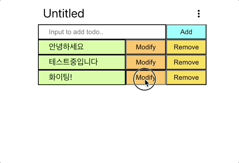
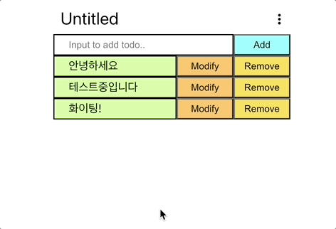

# todolist_frontend(en)

##### [한국어 버전은 이 곳을 클릭해주세요](README.md)

##### [日本語バージョンはこちらをクリックして下さい](README_JP.md)

## - Index -

1. Overview
2. Project goal
3. Features demo
4. Features for the next version
5. What needs to get fixed
    
    

### 1. Overview

- Project title : todolist_frontend
- Period : 2023.01.09 - 2023. 01. 15(7days)
- Member(s) : Dug Park
- Tech stack :  
     
   
   

### 2. Project goal

1. Creating a simple todolist page which is able to CRUD
2. Have to able to interact with backend server
3. Have to be considerate for user experience
    
    

### 3. Features demo  

1. Add todoitem 
   
2. Get todoitem 
   
3. Modify todoitem 
   
4. Remove todoitem 
   
5. Modify cetegory name 
   
6. Clear todos 
   
    
    

### 4. Features for the next version

1. Divide page into components
2. Display at least 2 todolists on a page
    
    

### 5. What needs to get fixed

1. Malfunctioning that requests are not sent on a case API requests exceed a certain number of try
2. Overall refactoring
