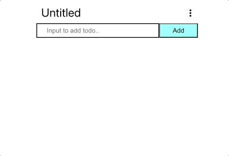
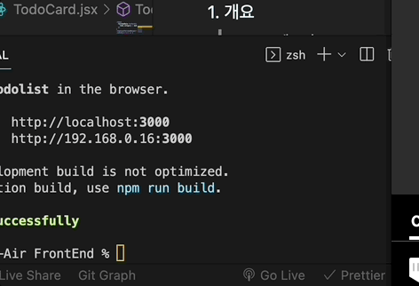
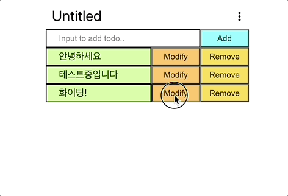
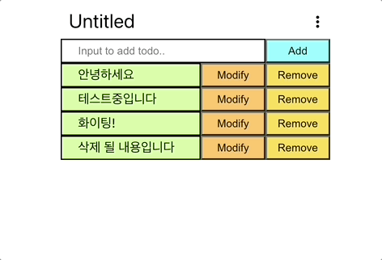
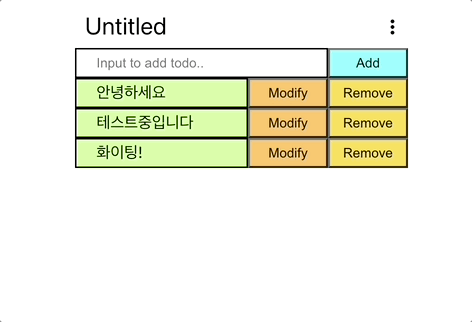

# todolist_frontend(jp)

##### [한국어 버전은 이 곳을 클릭해주세요](README.md)

##### [Click here for English version](README_EN.md)

## - 目次 -

1. 概要
2. Project 目標
3. 機能試演
4. 今後具現予定機能
5. 改善必要内容
    
    

### 1. 概要

- Project タイトル: todolist_frontend
- 期間 : 2023.01.09 - 2023. 01. 15(7 日)
- 人員 : 1 人
- 技術スタック :  
     
   
   

### 2. Project 目標

1. 簡単な機能の CRUD の todolist ページの製作
2. backend server との連動出来るように具現する事
3. 使用者の便利性を考慮して機能を追加する事
    
    

### 3. 機能試演  

1. todoitem 追加 
   
2. todoitem 読み込み 
   
3. todoitem 修正 
   
4. todoitem 削除 
   
5. cetegory タイトル修正 
   
6. cetegory 内容全体削除 
   
    
    

### 4. 今後具現予定機能

1. ページを component で分ける事
2. ひとつのページに二つ以上の todolist を配置する事
    
    

### 5. 改善必要内容

1. 特定度数以上 API 要請の時、API 要請が伝送出来ない現状改善
2. 全体的な refactoring
